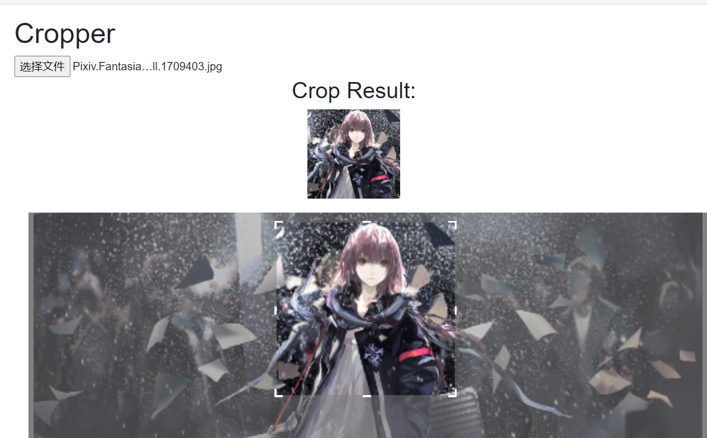

# Blazor.Cropper
A blazor library provide a component to crop image  
=>  
  

It is:
- almost full c#
- mobile compatible
- lighweight
- support proportion
- **GIF crop support**(only for files smaller than 1mb)
- open source on [github](https://github.com/Chronostasys/Blazor.Cropper)  

If you find Blazor.Cropper helpful, you could **star this repo**, it's really important to me.  

For a long time, crop image in blazor bother me a lot. That's why I tried to implement a cropper in blazor.

## Usage
to use it, you should first paste following code into your index.html:  
```html
<script src="_content/Chronos.Blazor.Cropper/CropHelper.js"></script>
```
Then, you can install our [nuget pkg](https://www.nuget.org/packages/Chronos.Blazor.Cropper) and use it like follow:
```razor
@page "/cropper"
@inject IJSRuntime JSRuntime;

<h1>Cropper</h1>
<InputFile id="input1" OnChange="OnInputFileChange"></InputFile>
@if (parsing)
{
    <center>
        <h2>@prompt</h2>
    </center>
}
@if (!string.IsNullOrEmpty(imgUrl)&&!parsing)
{
    <center>
        <h2>Crop Result:</h2>
        
    </center>
}
@if (file != null)
{
    <Cropper InputId="input1" ImageFile="file" OnCrop="@OnCropedAsync"></Cropper>
}
@code {
    IBrowserFile file;
    string imgUrl = "";
    Image image;
    string prompt = "Image cropped! Parsing to base64...";
    bool parsing = false;
    void OnInputFileChange(InputFileChangeEventArgs args)
    {
        image?.Dispose();
        file = args.File;
    }
    async Task OnCropedAsync(ImageCroppedEventArgs args)
    {
        parsing = true;
        base.StateHasChanged();
        await Task.Delay(10);// a hack, otherwise prompt won't show
        image?.Dispose();
        await JSRuntime.InvokeVoidAsync("console.log", "converted!");
        image = args.Image;
        imgUrl = args.Image.ToBase64String(args.Format);
        parsing = false;
    }
}


```
For more details, see [the sample project](CropperSample).  
To build it, simply clone it and run it in visual studio. The running result should be like this:  
  
## Note
In many cases, I found It's really slow to convert image data to base64 format and set it as img src in blazor(many times slower than image crop process). So I stronly recommend you to avoid doing this in blazor.

