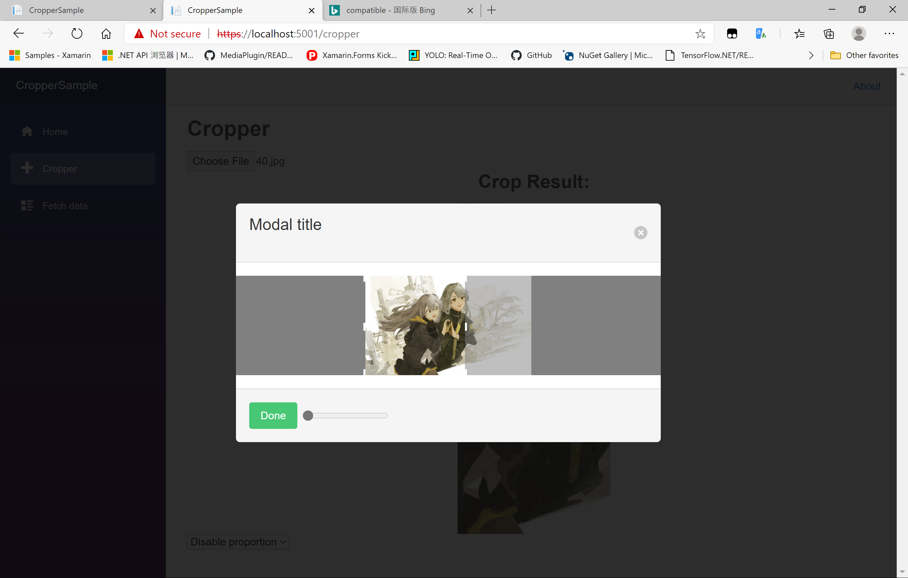

# Blazor.Cropper

[](https://app.codacy.com/gh/Chronostasys/Blazor.Cropper?utm_source=github.com&utm_medium=referral&utm_content=Chronostasys/Blazor.Cropper&utm_campaign=Badge_Grade)
[](https://bettercodehub.com/)


A blazor library provide a component to crop image  
=>  
    

[Sample site here](https://chronostasys.github.io/)  
It is:
- almost full c#
- fast
- mobile compatible
- lighweight
- support proportion
- **GIF crop support**(only for small files)
- support [maui(blazor)](https://github.com/dotnet/maui)
- open source on [github](https://github.com/Chronostasys/Blazor.Cropper)  

If you find Blazor.Cropper helpful, you could **star this repo**, it's really important to me.  

For a long time, crop image in blazor bother me a lot. That's why I tried to implement a cropper in blazor.    

## Users
- [CnGal](https://www.cngal.org/) CnGal是一个非营利性的，立志于收集整理国内制作组创作的中文Galgame/AVG的介绍、攻略、评测、感想等内容的资料性质的网站。

## Maui Usage (new)
Blazor.Cropper now supports [maui(blazor)](https://github.com/dotnet/maui)!  
In some platforms, you may need to use `FilePicker` to get the input image
rather than using html input element. You can find details in the [maui sample project](https://github.com/Chronostasys/CropperMaui)

## dotnet 6 changes
Although most of apis remains the same, there're some new apis which provide better 
performance in .Net 6.  
In dotnet 5, using `ImageCroppedResult.GetBase64Async();` to get the base64 result is fine. 
In dotnet 6, it should be replaced with `ImageCroppedResult.GetDataAsync();`, which may combined 
with new `SetImageAsync(this IJSRuntime js,byte[] bin,string imgid)` api to display the crop result.  
You may find dotnet 6 sample [here](CropperSampleV6)

## Server-side Usage
Blazor.Cropper is designed to be a client side library. However, [it can be used on server side blazor when setting `PureCSharpProcessing="true"`](https://github.com/Chronostasys/Blazor.Cropper/issues/30).  
Please note that using Blazor.Cropper on server side could consume remarkable amount of server resources(including bandwidth, cpu and memory).  
[Sample project](https://github.com/Chronostasys/ServerSideCropperExample)

## Quick Start
Only 4 steps to use Blazor.Cropper
### Step0. Add nuget  pkg
Install our nuget pkg at [nuget.org](https://www.nuget.org/packages/Chronos.Blazor.Cropper). 
Add namespace to `_import.razor`:  
```razor
@using Blazor.Cropper
```
### Step1. Add script referrence
Then, you should paste following code into your index.html:  
```html
<script src="_content/Chronos.Blazor.Cropper/CropHelper.js"></script>
```
### Step2. Add cropper
Just add cropper to your code. We recommend you to use it inside a modal card.  
**Note**: to use the cropper, you need to use a `<InputFile>` component to get a file source. 
You must provide a paramter named `InputId`, which's value is the same as the `id` attribute of the `<InputFile>` component.  
Example:
```razor
@* .... some code ...*@
<InputFile id="input1"></InputFile>
<Cropper InputId="input1" ></Cropper>
@* .... some code ...*@
```

### Step3. Get result
To get the crop result, you need to get the reference of the `Cropper`, then call the `Cropper.GetCropedResult()` method.  
Example:  
```razor
@* .... some code ...*@
<Cropper InputId="input1" @ref="cropper"></Cropper>
@* .... some code ...*@
@code{
    Cropper cropper;
    @* .... some code ...*@
    void GetCropResult()
    {
        var re = cropper.GetCropedResult();

        // in dotnet 6 or later
        var buffer = await re.GetDataAsync();
        // donot transfer bytes to base64 in dotnet 6.
        // if you want to display the crop result, use 
        // SetImageAsync(this IJSRuntime js,byte[] bin,string imgid) to
        // do the job


        // otherwise, get base64 directly
        // var base64 = await re.GetBase64Async();
    }
    @* .... some code ...*@
}
```


## Api referrence
We have detailed xml comments on Cropper's properties & methods, simply read it while use it!  
On the other hand, you can go to [the sample project](CropperSampleV6) for usage examples.  
To build it, simply clone it and run it in visual studio. The running result should be like this:  
  

